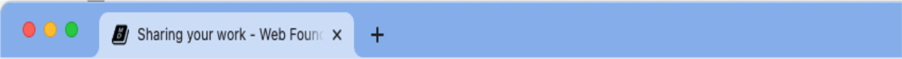

# Sharing your work

*Estimated Time: 20 minutes*

---

Some of the sites you’ve made in this class are just for practice. Others, you might be proud of, and want to show off!

This lesson is a collection of tips for making your site nicer for sharing.

## Test your site

The most basic tip is also the most important. *You need to test your site.*

- Load your site.
- Note any issues or areas for improvement. Is there anything that’s unclear?
- Fix those areas

Some testing strategies that you might not think of immediately:

- Test your site on different devices, at different widths. Make sure it looks right when it’s a different size.
- Show your site to other people, and ask them for feedback. They will notice things that you don’t.
- Consider what someone else will know when they come to your site. The purpose of your site may be obvious to you, but it may not be obvious to someone else.

There are a lot of tools and tricks for testing websites to make sure they are great. [Lighthouse](https://developers.google.com/web/tools/lighthouse) is a tool built right into the Browser DevTools, which will make suggestions geared towards improving performance and accessibility.

## Write a Readme

If you are sharing your code with another developer or with an employer, you should write a Readme file.

The `Readme` is a file that tells what the project is about. It explains things like what you were thinking, who the project is for, what tools you used, and how someone might contribute. 

On Github, the Readme file serves as a landing page for a project. Since Github is a social site for developers, Readme pages are a really important way of communicating to other developers.

If you visit the [Github page for the DevTools Scavenger Hunt](https://github.com/kiboschool/devtools-scavenger-hunt/tree/main), you’ll see that the Readme explains what the site is for, and links to more information about Kibo. The expectation is that other developers might see this page, and read the Readme to learn about the site and about Kibo.

If you are putting your work on Github, other developers might find it! The best thing you can do to make your online developer profile stand out (other than make great projects) is to write clear a Readme for your project.

<aside>


👀 Check out [MakeAReadme.com](https://www.makeareadme.com/) which explains the why and the how of writing a Readme for your project.

</aside>

## Title and Favicon

What shows up in the tab bar for this page is the *title* and *favicon.*



You can control these! 

The `<title>` tag determines what text shows in the tab bar. A file typically called `favicon.ico` sets the little icon for the site.

**<details><summary> Further reading: MDN on Title and Favicon </summary>**
    
See [MDN’s guide on metadata in the `<head>` tag](https://developer.mozilla.org/en-US/docs/Learn/HTML/Introduction_to_HTML/The_head_metadata_in_HTML). 

MDN also has more information about [showing different versions of the favicon](https://developer.mozilla.org/en-US/docs/Web/HTML/Element/link#providing_icons_for_different_usage_contexts) depending on the screen size.

</details>

## Sharing meta tags

When you share a link to a site on Discord, there’s a preview of the site. It shows the title, an image, and a description of what you’ll find if you click the link.

You can control how that preview looks!

The `<title>` tag determines what title will show in the social preview. In addition, various `<meta>` tags control how other elements of the preview will show.

🏷️ [Metatags.io](https://metatags.io/) lets you build and preview the `<meta>` tags for multiple sites at once. It also has a bunch of helpful tips about what the different tags mean, and how they are relevant to how a brand is perceived on social media, in search, and more.

```jsx
<!-- Primary Meta Tags -->
<title>Kibo Demo | Chicken Peanut Stew Recipe</title>
<meta name="title" content="Kibo Demo | Chicken Peanut Stew Recipe">
<meta name="description" content="(demo for learning web development) 
This recipe for Chicken Peanut Stew has everything going on. It's sweet yet fiery, crunchy yet smooth. Adapted from Marcus Samuelsson.">

<!-- Open Graph / Facebook -->
<meta property="og:type" content="website">
<meta property="og:url" content="https://metatags.io/">
<meta property="og:title" content="Kibo Demo | Chicken Peanut Stew Recipe">
<meta property="og:description" content="(demo for learning web development) 
This recipe for Chicken Peanut Stew has everything going on. It's sweet yet fiery, crunchy yet smooth. Adapted from Marcus Samuelsson.">
<meta property="og:image" content="https://metatags.io/assets/meta-tags-16a33a6a8531e519cc0936fbba0ad904e52d35f34a46c97a2c9f6f7dd7d336f2.png">

<!-- Twitter -->
<meta property="twitter:card" content="summary_large_image">
<meta property="twitter:url" content="https://metatags.io/">
<meta property="twitter:title" content="Kibo Demo | Chicken Peanut Stew Recipe">
<meta property="twitter:description" content="(demo for learning web development) 
This recipe for Chicken Peanut Stew has everything going on. It's sweet yet fiery, crunchy yet smooth. Adapted from Marcus Samuelsson.">
<meta property="twitter:image" content="https://metatags.io/assets/meta-tags-16a33a6a8531e519cc0936fbba0ad904e52d35f34a46c97a2c9f6f7dd7d336f2.png">
```


Try going to [Metatags.io](https://metatags.io/) and generating the meta tags for a site of your own.

## When should you share your site?

For some people, sharing comes naturally. Others are more shy, and hesitate to share their work.

We encourage you to share your work early. Here’s (just some) of the reasons why:

- It’s motivating when others see what you’ve learned and created.
- You’ll get feedback about what you’ve made, which helps you learn
- Sharing your project helps others to learn

Sometimes sharing is uncomfortable! It’s okay to tell people when you share “I’m just a beginner, and this was my student project”, if that helps you feel more comfortable sharing your work.
