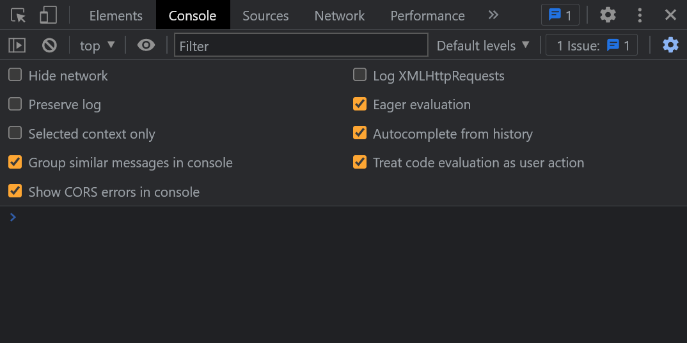
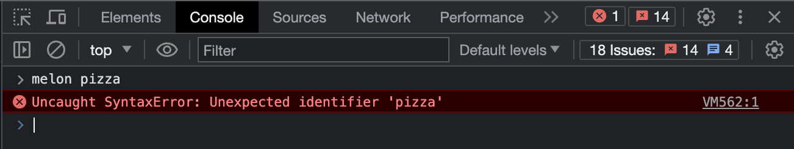
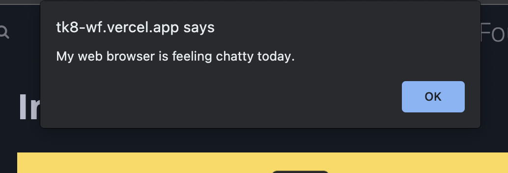

# Introduction to Javascript

<div style="position: relative; padding-bottom: 56.25%; height: 0; margin: 20px 0px;"><iframe src="" title="YouTube video player" frameborder="0"  allowfullscreen style="position: absolute; top: 0; left: 0; width: 100%; height: 100%; background: url(./actions/jav.png); background-size: cover;"></iframe></div>

## About JavaScript

The JavaScript language is responsible for changing data and allowing webpages to interact with users. It is different from HTML and CSS in some important ways.

HTML and CSS happen “all at once”. When the web browser loads it shows the whole HTML page, with all of the CSS styles applied. The order of HTML elements determines the structure of page content, and CSS determines which styles are applied, but they have no concept of “time” or "change".

JavaScript happens step by step over time. Like a recipe for cooking a meal. Each line "runs", one after the other. Think about Javascript as instructions for the computer to follow to complete a task, like cooking a recipe or building a bike.

<aside>


⚠️ **JavaScript is a deep topic.**

You’ll learn the fundamentals of JavaScript in the next few lessons, enough to do some small calculations and print messages. Next week, we will learn how to use Javascript to interact with the webpage. 

There’s way more to JavaScript which we aren’t covering here. Learning Javascript can help you learn other programming languages like Python or C, because it is more similiar to them than HTML or CSS are.

After this course, you can find other resources to pursue further learning in JavaScript, or consider joining Kibo's [Computer Science Degree program](https://kibo.school/degree/).

JavaScript can be **confusing**. Don’t be surprised if you get stuck on the syntax or logic. Ask your classmates and instructors for help!

</aside>


### JavaScript in 14 minutes

<aside>


👉🏿 **Try it**: JavaScript in 14 minutes

For a quick overview of the main concepts in JavaScript, try [JavaScript in 14 Minutes](https://jgthms.com/javascript-in-14-minutes/).

- Follow the link to [https://jgthms.com/javascript-in-14-minutes/](https://jgthms.com/javascript-in-14-minutes/)
- Read the instructions and click each link to learn the basics of data types, functions, variables, conditionals, and loops.
- Don’t expect to memorize all the concepts now! You’ll get some chances to practice and re-learn later on.
</aside>

## DevTools Console

You’ve been using the DevTools for debugging HTML and CSS for the entire class. Now that you’re learning JavaScript, you can use a whole new part of the DevTools: the Console.

Like you learned in the exercise above, you can open the console with a keyboard shortcut, or right-click the page and then click on **"Inspect"**. Open the console now, on this page. It should look something like this:



### Log messages

The browser can display information from JavaScript code to the console. You may see some **log messages** when you open the console, from the JavaScript that’s already running on the page.

You can display messages to yourself with JavaScript by writing the following code snippet in the console and hitting the **Enter** key.

`console.log("the message you want to say")`

Try it now!

### Error messages

Another thing you might see in the console are **error messages.** They tell you what has gone wrong on the page and are usually shown in red text.

You can see an error if you type something that isn’t valid JavaScript, like `melon pizza`. For me, that shows the error message `Uncaught SyntaxError: Unexpected identifier`. Try it out in the console to see if you get the same error.



### Alert messages
You can also show popup messages to a user reading the page using the **alert** function. You can alert messages to yourself with JavaScript by writing the following code snippet in the console and hitting the **Enter** key.

`alert("the message you want a user to see")`

Try it now!



### A playground for code

The console isn’t just for log and error messages. The console lets you try out JavaScript code and see the result, like how the Elements panel and Styles tab let you try out different HTML elements and CSS properties.

Just like the Elements and Style tab, you can’t permanently break anything by typing the wrong JavaScript into the console. You can always reset your changes by refreshing the page.

> However, if you *want* your changes to be saved between page refreshes, you’ll need to copy what you write into a JavaScript file like `script.js` and run it from there.

So far, you might not know much JavaScript that you could run in the console — you’ve seen how to make an error, but that’s not very useful. You’ve seen how to log a message, which could be useful eventually, but doesn’t do a whole lot yet.

In the activity above, you also learned `alert`, which shows a popup message on the page. That’s kinda of cool! Perhaps even more useful for you, the console can act like a built-in calculator.

Try entering the following lines of code into the console one by one. Press the Enter key after each line, and see the result:

```javascript
11 * 45

6000 - 440 - 31 - 195

2 ** 10

18 / 3
```

We won’t do a whole lesson on numbers in JavaScript now, but you can start to use the console as a calculator that you can use on every webpage!

## Activity: Use the Javascript console

Open up the JavaScript console, and practice entering some expressions, such as:
- calculations with numbers, like above
- using `alert` to show a popup message
- using `console.log` to show a message in the console
- typing something that is not valid JavaScript, to see what an error message looks like
