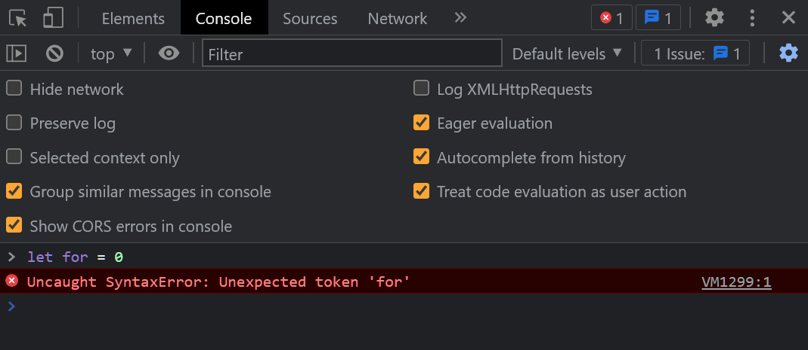

# JavaScript Syntax

The syntax of a spoken language defines the correct order and arrangement of words. JavaScript's syntax has many of the same features as other programming languages. This lesson will serve as a quick tour of those features. We will go into more detail in the following lessons.

## Basics and Data Types

JavaScript evaluates statements one line at a time.

* **Numbers** are represented by typing them literally, like `15` or `-3.14`.
* **Strings** are letters or other characters enclosed in single or double quotes, like `"hello"` or `'world'`.
* **Arrays** are lists created using square brackets `[1,2,3]` and items inside of the array are accessed using square brackets`numbers[1]`.

## Keywords

Javascript reserves some special words that are used to do specific things. Each of these **keywords** has rules defining how they're allowed to be written. When we don't follow these rules, Javascript will show us helpful error messages to point out the problems. For example, `let for = 0` shows us the error. 



Some examples of Javascript keywords are `let` `const` `if` `for` `function` and `else`, although there are many others.

## Comments

* JavaScript comments allow you to describe your code in plain language, or disable code from running.
* Single-line comments start with `//`.
* Multi-line comments start with `/*` and end with `*/`, and will disable everything between them.

```js
// This is a single line JavaScript comment

/* This is a
mutliple line
Javascript comment
*/
```

Normally writing `melon pizza` would show an error message. Writing it in a comment will cause Javascript to skip the comment and continue running the code that comes after it.
```js
alert("Hello, world! My favorite pizza is ")
// melon pizza
console.log("Pepperoni")
```

## Variables

Variables are temporary holders of data that you can name and then reuse later in your program.

In JavaScript, you have to use a keyword before your variable name to define it:

```js
let x = 10
let name = "Wasiu"
let numbers = [1,2,3]
```

There are two other keywords (`var` and `const`) that also create variables that behave slightly differently, but for now you should be okay just using `let`.

## Conditions

JS uses the keyword `if` for conditional statements. If the condition evaluates to true, it will run the lines between the curly brackets. If the condition evaluates to false, it will skip those lines:

```js
let x = 75
if (x < 100) {
  console.log("it was less than one hundred")
}
```

The condition is wrapped in parenthesis `()`, and the statement to be run is wrapped in curly braces `{}`. This `console.log` will be run because the condition `(x is less than 75)` is true.

## Loops

JavaScript can loop through an array (also known as a list) to perform the same actions on every element inside of the array. 

```js
let numbers = [1,2,3]
for (let number of numbers) {
  console.log(number)
}
```

Like for conditional statements, JavaScript wraps the initialization in parens `()` and the body of the loop in curly braces `{}`.


## Functions

Functions are reusable instructions for running several statements in Javascript. Some functions like `console.log` are pre-defined for you to use in Javascript to perform common tasks, like printing a message in the console. You can also define your own functions using the `function` keyword.

The result of running functions can depend on the data you pass into the parenthesis `()` when the function is run. This data is called an "argument". However, arguments are optional and not required in every function.

`console.log("hello")` passes the argument `"hello"` to the function `console.log`. The dot between `console` and `log` may be unfamiliar, but the function call works similarly to what you've used before.

To define a function in JavaScript, you can use the `function` keyword, followed by parenthesis `()`, and then curly brackets `{}`. Defining a function is like writing down a recipe on paper to cook later.

To run a function, write the function's name followed by parenthesis and any data you would like to "pass" into the function to use. Running a function is like using a recipe to cook a meal right now. It will make the function perform the tasks defined between the opening `{` and closing `}` curly braces. 

```js
function greetPerson(name) {
  let greeting = "Hello, " + name
  console.log(greeting)
}

greetPerson("Tolu") // logs "Hello, Tolu"
greetPerson("Rosemary") // logs "Hello, Rosemary"
greetPerson("Oluwaseyi") // logs "Hello, Oluwaseyi"
```

Functions can also be defined without requiring arguments to be passed when they are run.

```js
function greetWorld() {
  console.log("Hello, world!")
}

greetWorld() // logs "Hello, world!"
```

There are more ways to create functions in JavaScript, but that's all you need to know for now.

## Objects

Objects are a way of grouping several realtes values together curly brace syntax to create them and the square brackets to access items inside.

```js
let party = {
  "name": "Birthday Party",
  "date": "November 20",
  "guests": ["Mom", "Dad", "Brother"]
}
console.log(party["date"]) // November 20
```

JavaScript uses objects even more heavily than Python uses Dictionaries, but we won't go any deeper in this class.

## Conventions

As you saw with the `greetPerson` example, JavaScript typically uses "camelCase" naming for variables and functions, instead of the "snake_case" that Python typically uses.

JavaScript isn't whitespace-sensitive like Python is. It's still conventional to format your code so that blocks are indented, but it's not mandatory like Python.

The JavaScript interpreter in the browser will permit code that is formatted all on one line, like:

```js
function greetPerson(name) { console.log("Hello, " + name) }
```

This should be avoided, but it's sometimes helpful to know.

