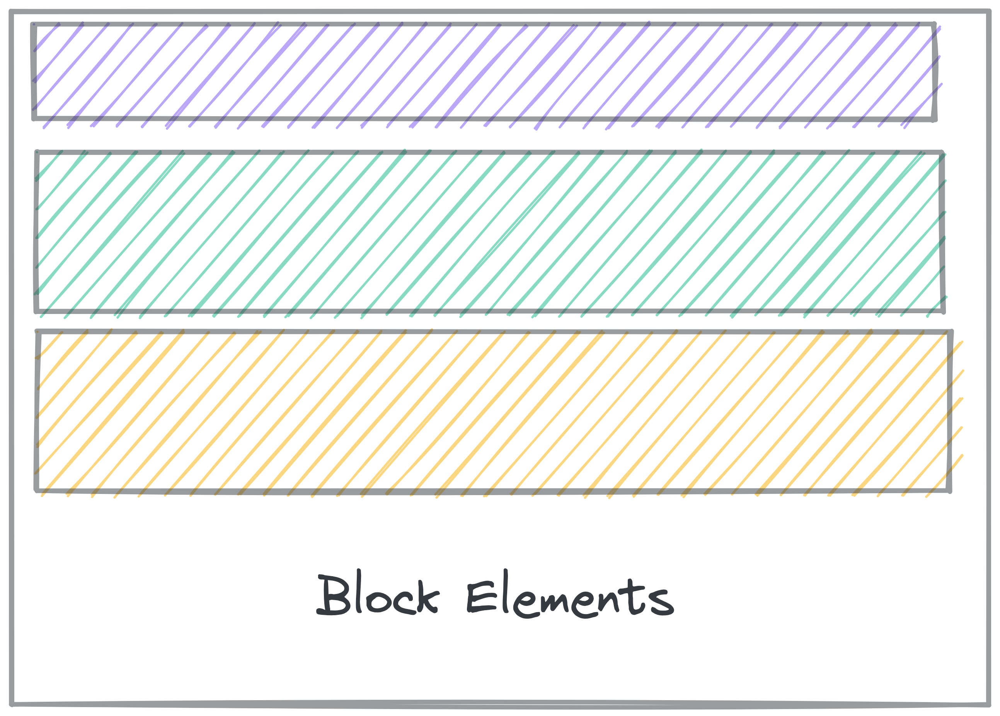
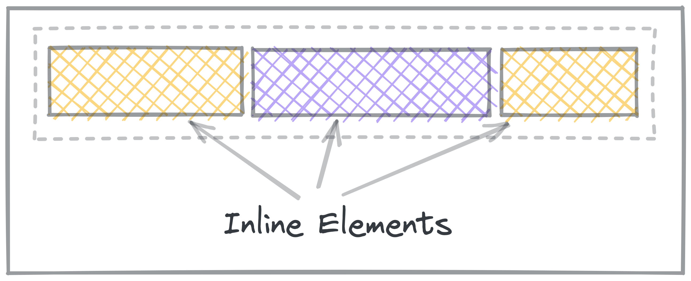
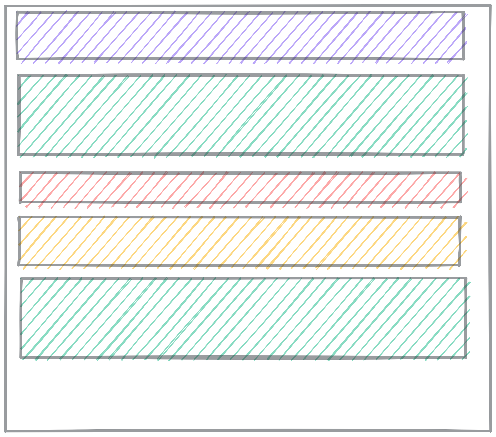

# Layout

With the Box Model, you can control the size and spacing in and around elements. But, the box model doesn’t let you position elements anywhere you want.

In this lesson, you’ll learn about laying out the elements on the page.

> 🚧 Layout can be time-consuming and difficult. Be patient!

## CSS Layout

Layout means controlling the arrangement of the elements on the page.

It’s challenging because it involves the interactions between lots of different properties: the sizes of the elements (per the Box Model), their nesting relationships with each other, and lots of other CSS properties.

We won’t cover every detail about layout in this lesson. We’ll focus on three key concepts:

- Understanding Normal Flow
- The `display` property
- Flexbox

There are tons more things to learn about layout, but with these four concepts, you should be able to achieve most layouts you want.

<strong>Further Exploration: MDN Layout Overview</strong>

In this lesson, we’re leaving out things you might want to learn eventually. Left-out topics include:

- Float
- Table layout
- Multi-column layout
- Responsive design and media queries

Check out [MDN’s Introduction to CSS Layout](https://developer.mozilla.org/en-US/docs/Learn/CSS/CSS_layout/Introduction) for an overview of layout topics.

## Display

<strong> 🎥 Watch this video from WDS on CSS `display`</strong>

<iframe src="https://www.youtube.com/embed/Qf-wVa9y9V4?start=16" title="YouTube video player" frameborder="0" allow="accelerometer; autoplay; clipboard-write; encrypted-media; gyroscope; picture-in-picture" allowfullscreen style="position: absolute; top: 0; left: 0; width: 100%; height: 100%;"></iframe>

The `display` property controls how each element gets treated in the flow.

- Is it treated as _block_ or _inline_? (the **outside** display)
- How do elements flow **inside** the element? (the **inside** display)

First we'll talk more about block and inline elements, then we'll talk more
about another kind of flow called _flexbox_.

### Block and Inline

**Block** elements get line breaks before and after the element, so they show up on their own line. You can set `display: block;` to make an element act as a block.

Elements like `
`, `
`, `<h2>`, and `<section>` all have `display: block;` automatically, so you don’t need to set it.

**Inline** elements don’t get line breaks, so show up inline with other elements.

You can set elements to `display: inline;` to force them to show inline with other elements.

Elements like `<a>`, `<em>`, and `<strong>` automatically have `display: inline;`, so you don’t need to set it yourself.

**Inline Block** elements are a mix of both. `display: inline-block` makes the
element show up inline, but take up space like a block.

## Practice: Block and Inline

<aside>

📺 Practice using the `display` property and your new understanding of inline and block elements.

</aside>

## Other `display` values

### `display: none;`

`none` is a special display value that hides content.

This is particularly useful if you want to hide something, like if it should only appear when a button is clicked.

### `display: flex;`

This turns the contents into a _Flexbox_.

You'll learn about Flexbox in another lesson.

### `display: grid;`

This turns the contents into a _Grid_.

You'll learn about Grid in another lesson.

<strong>Normal Flow</strong>

**Normal flow** is how elements are laid out on the page by default.

In Normal Flow, block elements stack on top of each other, each on its own line.

- **Block elements** fill up 100% of the available width. Usually, that’s the width of the screen. They are as tall as their content.

- **Inline elements**, like links and spans, are laid out inside the block elements, and don’t go on new lines.

When you learn about Flex and Grid, those are _alternate flow modes_. Elements will no longer follow the normal flow rules.

> Read more about [Normal flow on MDN](https://developer.mozilla.org/en-US/docs/Learn/CSS/CSS_layout/Normal_Flow).

<strong>Inside Display</strong>

So far, we’ve only talked about _Normal flow_, using block and inline elements.
There are other flow modes that make creating certain layouts much easier.

When you set `display` to other values, you change how the elements
**inside** that element get displayed. Instead of Normal flow, they use other
layout rules.

The only other flow mode we’re going to explore in depth is `flex`. You might
come across grid and table layouts.

The [MDN reference on the CSS display property](https://developer.mozilla.org/en-US/docs/Web/CSS/display) lists comprehensive information about what the possible display values are. You can get by without knowing most of them, but the possible inside display values are `flow`, `flow-root`, `table`, `flex`, `grid`, and `ruby`.

