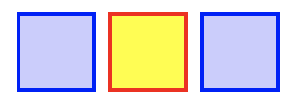
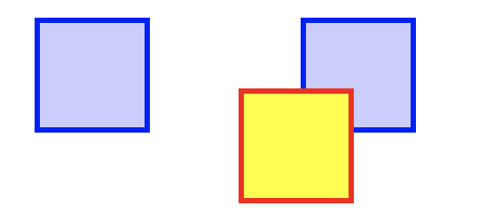
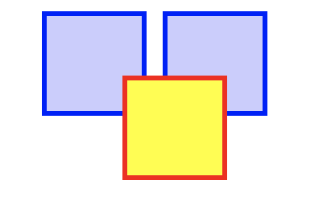

# Positioning

The `position` property can break Normal flow. Unlike `flex`, which makes a container where the normal flow rules don’t apply, `position` can take an individual element out of the flow.

<aside>

🎥 **Video: Watch this video from WDS on CSS `position`**

This video from Web Dev Simplified shows the main ideas of positioning.

<div style="position: relative; padding-bottom: 56.25%; height: 0;"><iframe src="https://www.youtube.com/embed/jx5jmI0UlXU?start=15" title="YouTube video player" frameborder="0" allow="accelerometer; autoplay; clipboard-write; encrypted-media; gyroscope; picture-in-picture" allowfullscreen style="position: absolute; top: 0; left: 0; width: 100%; height: 100%;"></iframe></div>

</aside>

There are five values for `position`.

```css
position: static;
position: relative;
position: absolute;
position: fixed;
position: sticky;
```

*See the [MDN docs for `position`](https://developer.mozilla.org/en-US/docs/Web/CSS/position) for more, and for an interactive example.*

### Static

`static` is how elements are positioned by default. The normal flow rules apply.

```css
position: static;
```



### Relative

`relative` means the element shifts from where it would normally be positioned.

`top`, `bottom`, `left`, and `right` are used with position to specify where to move the positioned element.

```css
position: relative;
top: 40px; left: 40px;
```

The yellow box is shifted 40px from the top and 40px from the left of where it started.



### Absolute

Absolute positioned elements are out of the flow.

```css
position: absolute;
top: 40px; left: 40px;
```

The yellow box is out of the normal flow, so the blue boxes act as if it isn’t there.

The `top` and `left` values are calculated from the parent element, instead of where the box started.



### Fixed

Fixed position means that as you scroll, the element stays in the same spot on the screen, within the scroll window.

Like `absolute`, `fixed` elements are removed from the flow, and they calculate the top and right values from the containing element.

```css
position: absolute;
top: 80px; left: 10px;
```

Scroll the example to see how the block stays in place while the rest of the page scrolls by.

<div style="position: relative; height: 300px; width: 500px;"><iframe src="https://yari-demos.prod.mdn.mozit.cloud/en-US/docs/Web/CSS/position/_sample_.fixed_positioning.html" frameborder="0" webkitallowfullscreen mozallowfullscreen allowfullscreen style="position: absolute; top: 0; left: 0; width: 100%; height: 100%;border: 2px solid grey;"></iframe></div>

### Sticky

`position: sticky` is really cool. It works like `relative`, until the element reaches the edge of the scroll window.

Then, the `sticky` element is ‘stuck’ to the top of the scroll window, until you scroll past the end of what it’s contained in.

```css
position: sticky;
```

Scroll the example to see the effect.

<div style="position: relative; height: 300px; width: 500px;"><iframe src="https://yari-demos.prod.mdn.mozit.cloud/en-US/docs/Learn/CSS/CSS_layout/Positioning/_sample_.basic_example.html" frameborder="0" webkitallowfullscreen mozallowfullscreen allowfullscreen style="position: absolute; top: 0; left: 0; width: 100%; height: 100%;border: 2px solid grey;"></iframe></div>

> **Further Exploration: Position**
>
> [MDN’s page on positioning](https://developer.mozilla.org/en-US/docs/Learn/CSS/CSS_layout/Positioning) provides more detail on the `position` property and how to use it.

## Practice: Absolute Robot

> 🤖 **The face has fallen off the robot!**
>
> Practice using the `top`, `left`, and `width` CSS properties and `position: absolute` to create a zany and fun face on the robot.
>
> [Complete the exercise on Replit](https://replit.com/team/web-foundations-july-2022/Absolute-Position-Make-a-Robot)