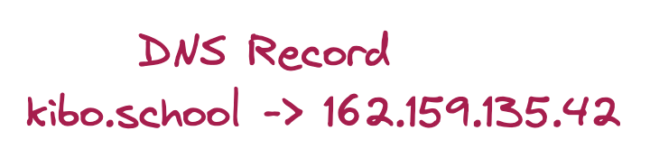
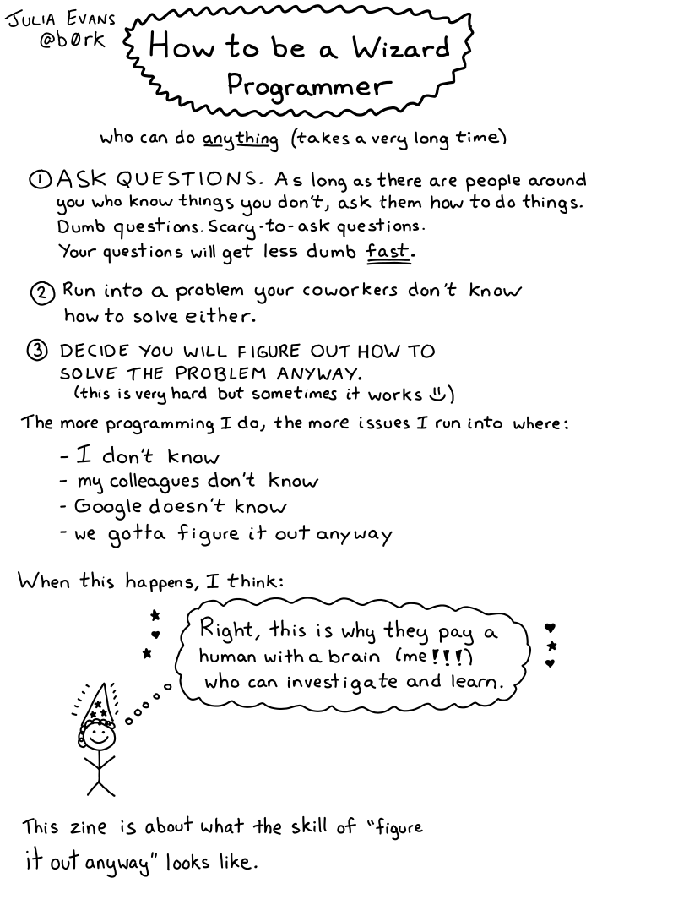

# Bonus: More about DNS

You don't need to know this to publish your site, but in case you were curious about DNS, here's more info.

## DNS Records

In the lesson on domains and hosting, you learned what DNS is for. Now let’s talk a about what it actually looks like! The graphic showed the record like this:



At its heart, DNS is really simple: it matches a name and a value. In this case, the name `kibo.school` is matched with the value `162.159.135.42`

The actual DNS record looks like this:

```txt
kibo.school.		3600	IN	A	162.159.135.42
```

This says that `kibo.school` points to `162.159.135.42`. It’s also got some extra info:

- There’s an extra `.` after `kibo.school`
- There’s a **TTL** of `3600`
- It’s an `IN` search
- It’s an `A` record

The extra dot means that it’s an *absolute* domain name. You can basically ignore this. (If it bugs you, you can read an explanation [here](http://www.dns-sd.org/trailingdotsindomainnames.html).)

**TTL** stands for “time to live”. It says how long a DNS server should keep a copy of this record before it checks again. If it’s shorter, updates to the DNS record will show up faster, but the website might load slower.

`A` is the *type* of record.

`IN` is for INternet. All DNS records are `IN`.

### Types of DNS Records

There are lots of different types of DNS records. Different types tell different kinds of information, like:

- `MX` records: The email server is located at this address
- `CNAME` records: This name points to a different name (instead of an IP address)

`A` records match a domain name to an IP address. For matching the domain `[kibo.school](http://kibo.school)` to the address `162.159.135.42`, we use an `A` record.

As noted in the video, IP addresses like `162.159.135.42` are version 4 addresses. `AAAA` records are for IP version 6.

<details><summary><strong>Further Reading: DNS</strong></summary>

Cloudflare is a popular service for DNS management, among other services and tools.

Their help center has great explanations on [What is DNS?](https://www.cloudflare.com/learning/dns/what-is-dns/) and [DNS records](https://www.cloudflare.com/learning/dns/dns-records/).

</details>

### Try it: Mess with DNS

👉🏿 Get hands-on practice creating DNS records to tell browsers where to find different websites.

<aside>

1. Go to [https://messwithdns.net/](https://messwithdns.net/)
2. Follow the three tutorial experiments to learn how to use the tool.
3. Do as many other experiments as you like, to explore creating different kinds of DNS records. Don’t be afraid to use Google to learn more as you explore.
4. Make sure you do the “**Set up a website**” experiment under the “**Useful experiments**” section

</aside>

### Questions about DNS

🤔 You’ve probably learned some pieces about DNS, but not everything.

Check your understanding of DNS and learn some more facts about DNS with this interactive game.

<aside>

Visit [https://questions.wizardzines.com/dns.html](https://questions.wizardzines.com/dns.html) and try to guess for each question. You might know some of the answers, and you’ll probably learn something too!

</aside>

## Further Reading

<details><summary>Julia Evans, creator of Mess with DNS and DNS Questions</summary>

Julia makes tons of awesome comics, like this one on [How to be a Wizard Programmer](https://wizardzines.com/zines/wizard/).



You can find more of her work online at [https://wizardzines.com/](https://wizardzines.com/).

Julia’s [blog post about the process of creating the Mess with DNS tool](https://jvns.ca/blog/2021/12/15/mess-with-dns/) is a really fun read!

She also has DNS-specific blog posts about [resolving DNS in Go](https://jvns.ca/blog/2022/02/01/a-dns-resolver-in-80-lines-of-go/) and [making DNS queries in Ruby](https://jvns.ca/blog/2022/11/06/making-a-dns-query-in-ruby-from-scratch/).

</details>