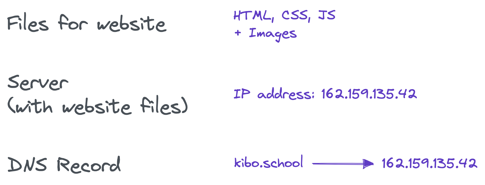
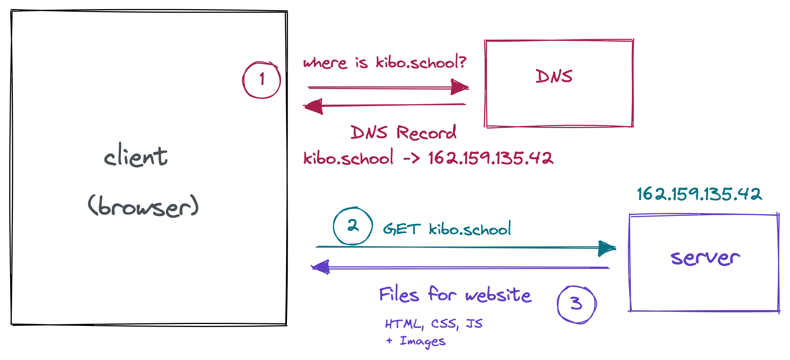

# Domains and hosting

## Domain Names

To give your site a custom URL, you need to have the **Domain Name**. Domain Names are how your browser finds the server to talk to for a particular URL.

Domain names are like `google.com` and `kibo.school`: the part of the url after the protocol (`https`) and before the page (`/search` or `/degree`)

## IP Addresses & DNS

<aside>

🎥 Check out this Code.org video to learn more about DNS

</aside>

<iframe src="https://www.youtube.com/embed/5o8CwafCxnU" title="YouTube video player" frameborder="0" allow="accelerometer; autoplay; clipboard-write; encrypted-media; gyroscope; picture-in-picture" allowfullscreen style="position: absolute; top: 0; left: 0; width: 100%; height: 100%;"></iframe>

**To recap:**

- The Domain Name System (DNS) is how your computer finds the address (like 162.159.135.42) like for a name (like kibo.school)
- DNS uses a *distributed hierarchy* of DNS servers. When one DNS server doesn’t know the answer, it asks another “higher” DNS server.
- 👑  “Root” DNS servers manage the *top level domains,* like .com and .org

### Further Reading: MDN on Domain Names

See the MDN page [What is a Domain Name?](https://developer.mozilla.org/en-US/docs/Learn/Common_questions/What_is_a_domain_name) for more

## What does it mean to own a domain name?

When someone buys a domain name, they get to decide which IP address the name points to. When Ope bought the [kibo.school](http://kibo.school) domain, she set the address to **162.159.135.42**. That’s the address of the Kibo server (right now, it's a managed Wordpress site, if you were curious).

## Website building and publishing steps

Making [kibo.school](http://kibo.school) involves these steps:

- Build the site (using HTML, CSS, and JS)
- Publish the site on a server
- Use DNS to make the [kibo.school](http://kibo.school) point to the server’s IP address

## How does your browser load kibo.school?

When you type [kibo.school](http://kibo.school) into your browser:

1. Your browser asks DNS for the address of [kibo.school](http://kibo.school), and gets back **162.159.135.42**
2. Your browser asks **162.159.135.42** for the actual webpage
3. The server at that address sends back the files that make up the site you see (HTML, CSS, and JS, plus images and videos)

## Getting a Domain

Okay, how do you actually get a domain like kibo.school, so that you can set up a website?

For most websites, you buy a domain. Some are expensive, and others are relatively cheap. There are also some services that offer free domains, which we’ll talk about too.

<aside>

⚠️ **You do not have to buy a domain for this class.**

We want you to know how, in case you ever want to buy a domain for a site.

</aside>

## Paid Domains

When you buy a domain, you are registered as the owner, usually for some number of years.

That gives you the ability to configure the DNS records, usually through a *registrar.* Often, the same companies that sell the domains will act as the registrar and allow you to configure DNS records.

Domains usually start at **$5-$10 USD**. There are often discounts for the first year of owning a domain. Some domains are more expensive: popular sites, business addresses, and short or memorable domain names sometimes cost thousands or millions of dollars!

### Further exploration: Domain pricing

The price often depends on the **top level domain (TLD).** TLDs are like `.com` or `.org` or `.gh`. Depending on the TLD, the price for a similar name might be very different.

There are lots of tools for searching and buying domains. [Google Domains](https://domains.google/) is a relatively high-quality tool. In the past, folks from our team have also used [Hover](https://www.hover.com/domains), [NameCheap](https://www.namecheap.com/), [Vercel](https://vercel.com), and others. We recommend using [Google Domains](https://domains.google/) if you are searching for or buying a domain. You may find a better price elsewhere, though!

## Free Domains

There are lots of hosting providers that will give you a free domain if you pay to host your site with their service. It’s usually not worth it, because their hosting is usually pretty bad.

There are some actually free domains available too (though registration is still required):

- [Replit](https://replit.com/) and [Github Pages](https://pages.github.com/) offer domains that have `.repl.co` and `.github.io` at the end, for free.
- Sites like [Neocities](https://neocities.org/) let you make your own website and host it on a `.neocities.org` domain for free. You can pay for a different domain name.
- [Co.vu](https://codotvu.co/) offers free `.co.vu` domains
- [Freenom](https://www.freenom.com/) offers free .TK, .ML, .GA, .CF, and .GQ domains, but reviewers say that it often doesn’t work.

The free domains are typically not as nice as domains you pay for.

## Walkthrough: Configuring DNS for a real domain

<aside>

🎥 In this walkthrough, Rob configures DNS for a real site using Github Pages and Google Domains.

See the live site at [http://recipe.kibo-demo.club/](http://recipe.kibo-demo.club/).

</aside>

<iframe src="https://youtube.com/embed/A7K7QnxE2ms" frameborder="0" webkitallowfullscreen mozallowfullscreen allowfullscreen style="position: absolute; top: 0; left: 0; width: 100%; height: 100%;"></iframe>

Video Recap

1. Starting point:
    - Already bought a domain using Google Domains
    - Already have a site published using Github Pages
2. Add a Custom Domain on the Github Settings page
3. Follow the instructions in the Github error message
    1. In Google Domains, click to DNS in the sidebar navigation
    2. Add a CNAME record
    3. With host name that matches your Custom Domain on the Github side (`recipe.kibo-demo.club` in the video)
    4. And data that match the [github.io](http://github.io) domain that you can copy from the error message (`kiboschool.github.io` in the video)
4. Be patient
    - Wait for a while, since it might take a few minutes.
    - It’s easy to mess things up, so take your time and be patient with yourself.

