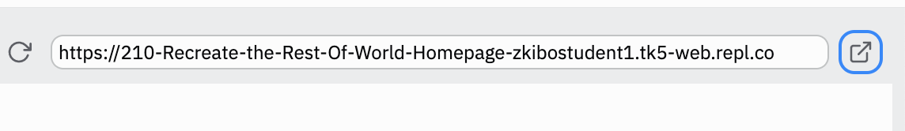
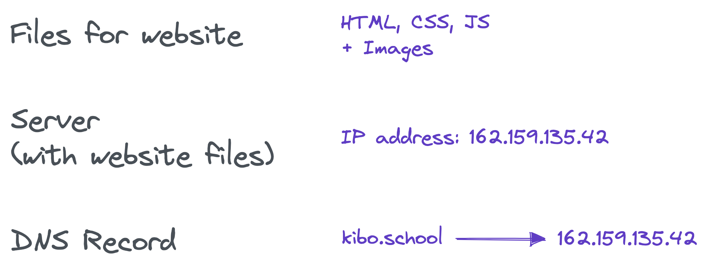

# Publishing your site

You want to share your website with someone else. That means that somewhere, there has to be a server to send the files to the browser.

# Publishing using Github Pages

Github Pages are easy to use if your code is already on Github.

Even if it's not, the steps are simple:

1. Sign in to Github
2. Add your code to a Github repository
3. Publish your new Github repository using Github Pages

## Publish your project using Github Pages

<aside>

🎥 See this video for a demo of how to publish your project using Github Pages.

</aside>

<iframe src="https://youtube.com/embed/aZNKxOodOYE" frameborder="0" webkitallowfullscreen mozallowfullscreen allowfullscreen style="position: absolute; top: 0; left: 0; width: 100%; height: 100%;"></iframe>

**Here’s the steps:**

1. Go to the Repository for your project on Github
2. Click “Settings” from the menu
3. Click “Pages” on the left sidebar
4. Select a branch (there should only be one, called `main`) and click “Save”

Your site should be available on Github Pages with a [github.io](http://github.io) domain name in a few minutes.

> You can see the Github repo here: [https://github.com/kiboschool/demo-recipe-site](https://github.com/kiboschool/demo-recipe-site)
>
> And the live Github Pages site here: [https://kiboschool.github.io/demo-recipe-site/](https://kiboschool.github.io/demo-recipe-site/)

## More About Github

For developers, Github is like Instagram or TikTok. It’s a place to share and remix ideas, see content from other developers, and to get a sense of what’s going on. Unlike other social media, Github is also a serious professional tool, used by teams of thousands of engineers to build complex software projects.

Sharing projects on Github is a typical way that developers show off their skills and build their portfolio of work. Github stores your code. It also has a built-in free publishing tool called Github Pages.

We haven’t covered anything about Git, the version control tool at the heart of Github, but you can use Github’s Pages feature without knowing everything about Git.

## Publishing using Replit

Every Replit web project has a built-in published version. You don’t need to do anything special to publish your Replit site, it’s automatically published.

When you run your code, the preview window has a **public URL** and an “open in new tab” button that links to your site. So cool!

<aside>

</aside>

When you run your code, the preview window has a **public URL** and an “open in new tab” button that links to your site. So cool!

Replit acts as the server for your files.

<aside>

</aside>

This is great! You can share the link with anyone you want, and they can see your site.

There are a couple downsides:

- Replit sites go to sleep after a while. They take a little while to wake up.
- The url for the site is bad looking and hard to remember.
- Who would remember to type in [https://210-recreate-the-rest-of-world-homepage-zkibostudent1.tk5-web.repl.co/](https://210-recreate-the-rest-of-world-homepage-zkibostudent1.tk5-web.repl.co/) ?

Using Replit to publish and share your sites can be great!

## Connect your Replit project to Github

Replit knows how to connect your project with Github, and store and sync the code. If you want the same project to be on Replit and Github, here's how.

<aside>

🎥 See this video for a demo of how to connect a Replit project to Github.

</aside>

<iframe src="https://youtube.com/embed/oG3dwUl8O70" frameborder="0" webkitallowfullscreen mozallowfullscreen allowfullscreen style="position: absolute; top: 0; left: 0; width: 100%; height: 100%;"></iframe>

Here’s a recap of the video

1. Pick a Replit project you’d like to store on Github and publish through Github Pages. (the project doesn’t have to be done yet!)
2. In the Replit project, click the branching tree icon for Version Control (it’s on the left panel below the files icon)
3. Click “Connect to Github”
    - Replit will prompt you to connect your Github account to your Replit account. Follow the prompts. Select “All Repositories” when prompted.
    - Go back to Replit after you’ve finished the steps to connect your accounts.
4. Click “Connect to Github” again. This time, it will allow you to enter the name of a new **Repository** (Github’s term for a project).
    - You can add a name and description for your project, which will show up on Github.
    - A “Public” repository will be visible. If you want other developers to see it, make it public.
    - The code for a “Private” repository will not be visible, but you can still publish the site using Github Pages.

## Other Servers and Hosts

There are lots of other services available to act as the server for your webpages. We aren’t going to mention them here, but it’s worth knowing that these aren’t your only options.

- There are other tools like Replit and Github that serve your pages as you’ve designed them.
- There are also tons of tools for writing custom servers, so your code decides what to send to the client.

Next, you’ll learn how to setup your website on its own custom domain.
