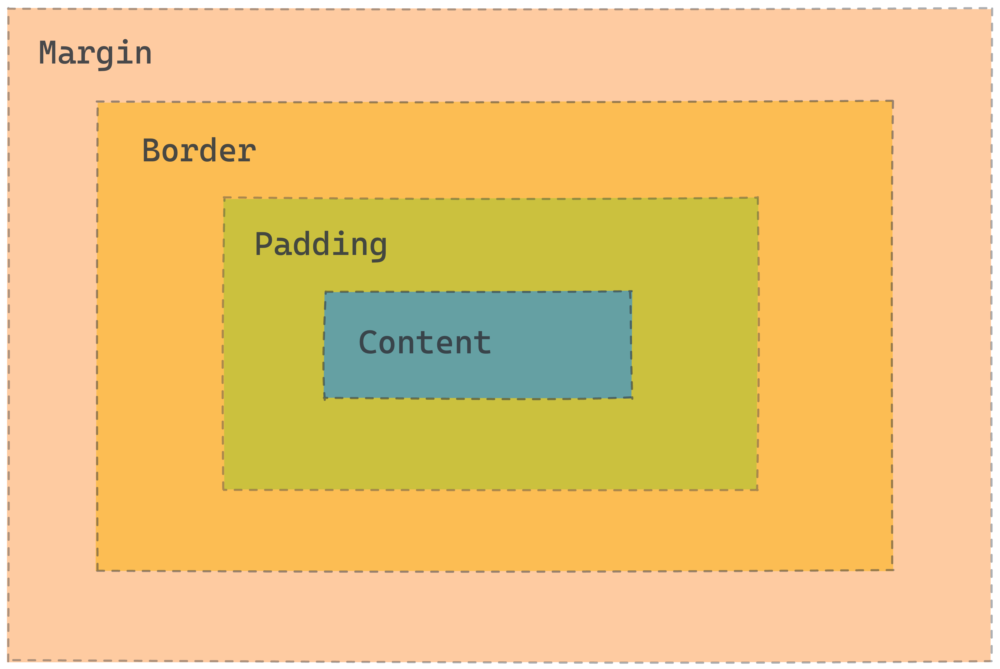
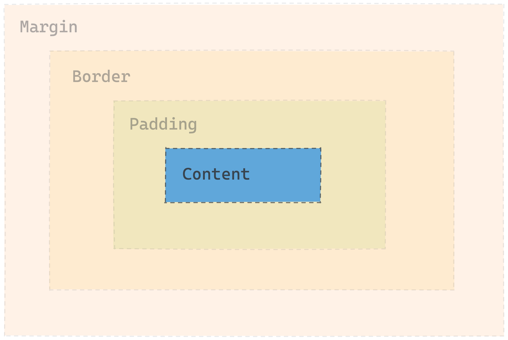
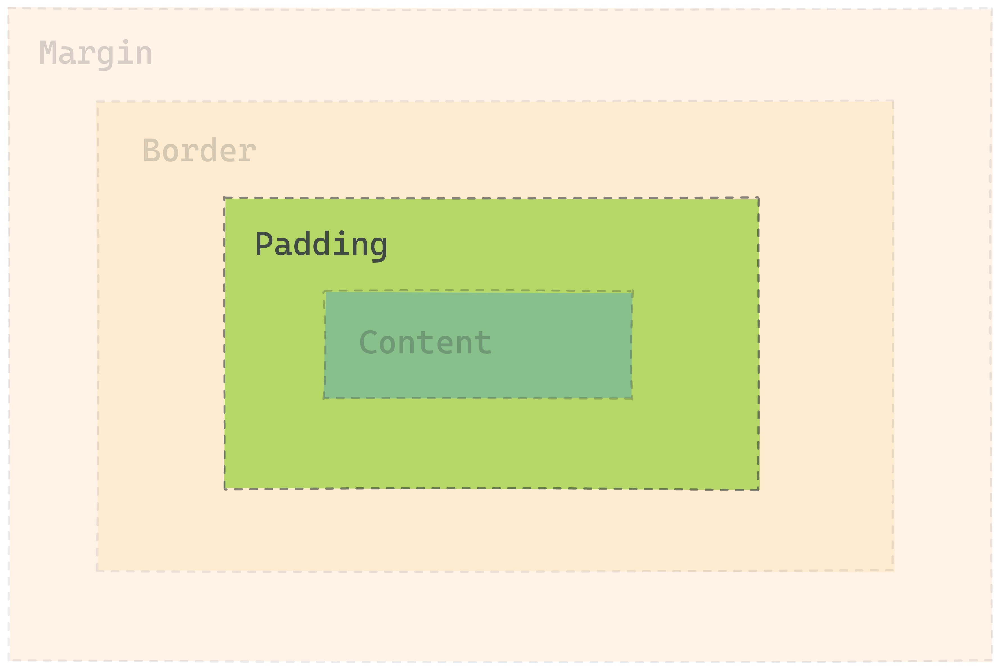
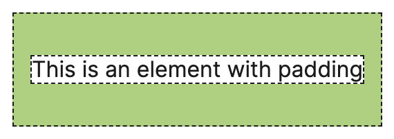
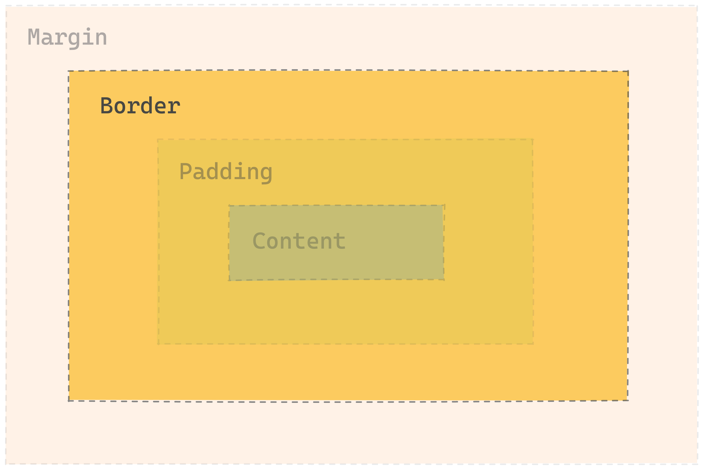
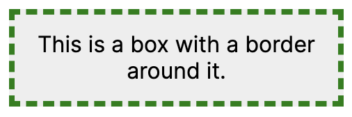
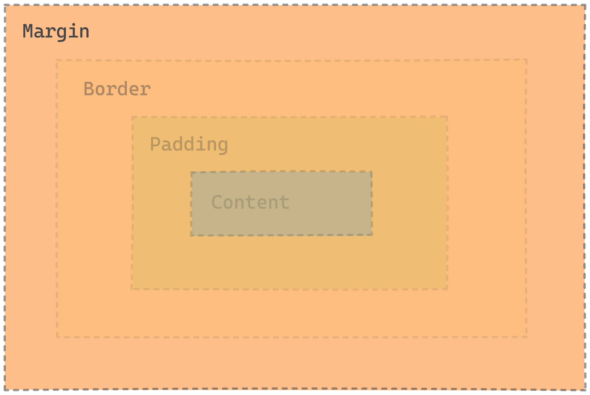
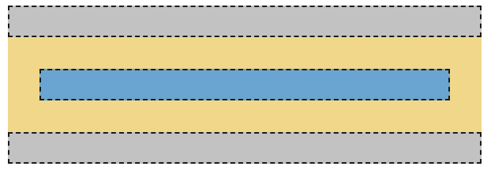
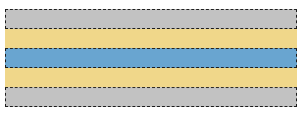
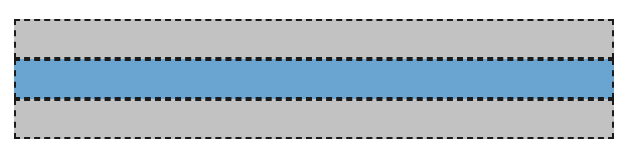

# The Box Model

<aside>

🎥 **Video:** Learn the CSS Box Model

This video from Web Dev Simplified explores the different parts of the Box Model covered in this lesson.

<div style="position: relative; padding-bottom: 56.25%; height: 0;"><iframe src="https://www.youtube.com/embed/rIO5326FgPE" title="YouTube video player" frameborder="0" allow="accelerometer; autoplay; clipboard-write; encrypted-media; gyroscope; picture-in-picture" allowfullscreen style="position: absolute; top: 0; left: 0; width: 100%; height: 100%;"></iframe></div>

</aside>

## Rectangles everywhere

CSS thinks in rectangles.

> Everything in CSS has a box around it.
>
> *[MDN Box Model](https://developer.mozilla.org/en-US/docs/Learn/CSS/Building_blocks/The_box_model)*

Everything on the screen in your browser — even if it shows up as a circle,
triangle, or squiggle — has a dedicated rectangle of space when browser figures
out where to put it on the screen.

### The Illustrated Box Model

Below is an illustration of the **Box Model**. Each element has margin, border, padding, and content.

If you know the Box Model, you can use CSS to control how much space the browser puts between the rectangles. It’s a key set of tools for you to use in making a page look good.

From the inside, going outwards:

- **Content** is what’s inside an element.
- **Padding** is the space between the element and the border.
- **Border** is a line around the element that can have some width.
- **Margin** is the space between elements.

These properties apply to the top, right, bottom, and left of the element.



## Box Model in the DevTools

Before you dive deeper into the box model, here’s a quick tutorial on how to view the box model in the DevTools.

<details>
<summary>
📽️ <strong>Video</strong>: Viewing the Box Model in the DevTools
</summary>
<div style="position: relative; padding-bottom: 56.25%; height: 0;"><iframe src="https://youtube.com/embed/rw9w7rsyE1U" frameborder="0" webkitallowfullscreen mozallowfullscreen allowfullscreen style="position: absolute; top: 0; left: 0; width: 100%; height: 100%;"></iframe></div>
</details>

## Content

Content is what’s inside the element.

It doesn’t have a single CSS property that sets how big it is. Instead, it’s the sum of the sizes of all the stuff inside.

For some elements, you can set the `width` and `height` properties to control the dimensions, but this doesn’t always work.



## Padding

Padding is the space between an element and its border.

It’s controlled by the `padding` properties:

- `padding-top`
- `padding-right`
- `padding-bottom`
- `padding-left`

You can set any of the properties on their own, or set them all at once with `padding`.

Check out the [MDN docs on padding](https://developer.mozilla.org/en-US/docs/Web/CSS/padding) for an interactive example and more information.



### `padding` example

The `padding` shorthand sets the top, right, bottom, and left in one line.

```css
/* top | right | bottom | left */
padding: 30px 12px 30px 12px;
```



<details>
<summary><strong>Further Exploration: CSS direction shorthands</strong></summary>

These are all equivalent:

```css
/* top | right | bottom | left */
padding: 30px 12px 30px 12px;

/* top | right and left | bottom  */
padding: 30px 12px 30px;

/* top and bottom | right and left  */
padding: 30px 12px;
```

If you leave out some of the 4 values, they get ‘filled in’ by the earlier value along the same axis.

If you use just 1 value, it applies to all 4 sides, so `padding: 1px` is the same as `padding: 1px 1px 1px 1px`.

The same shorthand works for the `border` and `margin` properties too.

</details>

## Border

Border is a line around an element, with a width, color, and style. It’s controlled by a set of `border` properties.

- `border-width`
- `border-color`
- `border-style`

These can each be set for the whole element, or for the top, right, bottom, or left, like `border-top-color` or `border-bottom-style`.



### `border` example

The `border` shorthand sets the width, style, and color for all 4 sides.

```css
/* width | style | color */
border: 4px dashed green;
```



See the [MDN docs on border](https://developer.mozilla.org/en-US/docs/Web/CSS/border) for more information.

## Margin

Margin is the space between one element’s border and another element. It’s controlled by a set of `margin` properties.

- `margin-top`
- `margin-right`
- `margin-bottom`
- `margin-left`

Like the other box model properties, `margin` is a shorthand for setting all of the properties at once.



### `margin` examples

`margin` is shown in yellow. It’s applied to the blue element.

```css
margin: 20px;
```

20 pixels of margin on all sides.



```css
margin: 20px 0;
```

20 pixels of top and bottom margin, 0 left and right margin.



```css
margin: 0;
```

0 margin on the top, bottom, left, and right.



## Practice: Box Model

<aside>

↔️ Practice applying the box model properties.

[Access the repl here](https://replit.com/team/tk10-wf/Practice-Box-Model)

</aside>

## Further Reading: Box Model

<details>
<summary>Further Reading: The Box Model</summary>

There's a lot more to learn about the box model!
These resources explain some of the topics we’ve skipped over here, like:

- box-sizing
- margin collapse
- `display: inline-block`
- ‘inner’ and ‘outer’ display

**Resources**

- MDN’s [page on the box model](https://developer.mozilla.org/en-US/docs/Learn/CSS/Building_blocks/The_box_model) explains the components of the box model in more detail.
- [Shay Howe’s tutorial on HTML and CSS](https://learn.shayhowe.com/html-css/opening-the-box-model/) is another useful explanation of how the Box Model works.
- [Colt Steele’s video on the Box Model](https://www.youtube.com/watch?v=M1xEi_BBW1I) is great if you enjoy video content

</details>


## Further Reading: Box model for inline elements

<details>
<summary>The box model is different for inline elements</summary>

One thing that can be pretty confusing: the box model is true for most elements, but... some elements don’t actually work that way!

Elements like `<a>`, `<span>`, `<strong>`, and `<em>` are **inline elements**. They don’t go onto a whole new line like a `<p>` or a `<div>`. Inline elements get a slightly different version of the box model than **block** elements.

Here are the differences for **inline boxes** (from [MDN](https://developer.mozilla.org/en-US/docs/Learn/CSS/Building_blocks/The_box_model)):

- The box will not break onto a new line.
- The `width` and `height` properties will not apply.
- Vertical padding, margins, and borders will apply but *will not cause other inline boxes to move away from the box*.

Horizontal padding, margins, and borders will apply and will cause other inline boxes to move away from the box.

MDN’s [page on the Box Model](https://developer.mozilla.org/en-US/docs/Learn/CSS/Building_blocks/The_box_model) explains more about block and inline boxes.

</details>
