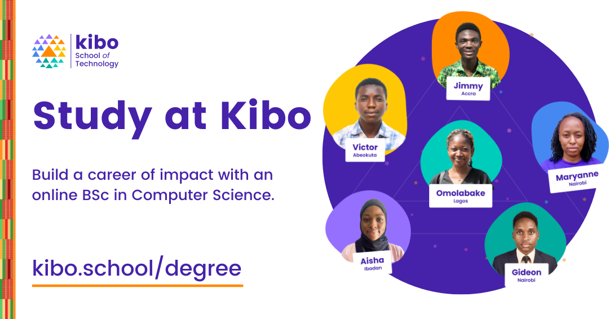
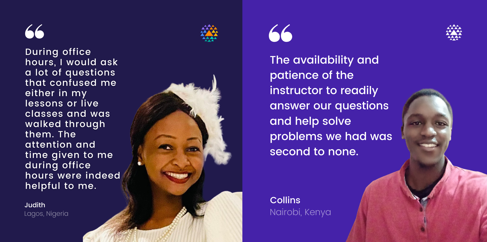
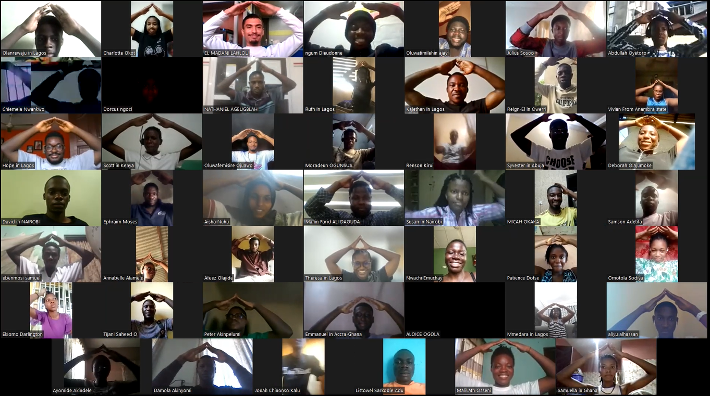
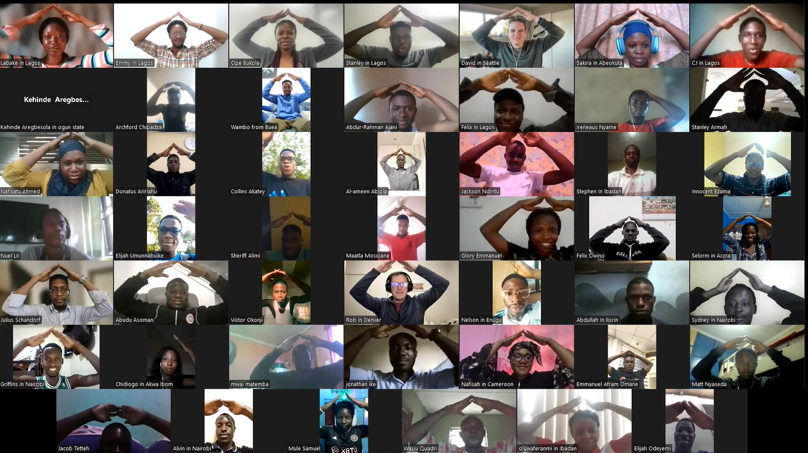

# Wrapping up: Final steps for Web Foundations

Congratulations on ***almost*** finishing your Web Foundations journey. Below is what you need to do to finish strong.

## Earn Your Certificate

You have worked really hard and we want to recognize that work with a certificate you can share digitally. To earn your certificate, **you need to complete the following by Friday, Dec 1**

- Complete the assignments from Weeks 1 through 3, and submit in Replit. (Note: these are the assignments on the “Project” pages of each lesson)
- Complete the **[Final Project](https://lms.kibo.school/course/tkwf_oct_2023/week_5_final_project_and_wrap_up/final_project)**
- Complete the <a href="https://forms.gle/dBRKYm9dorm1mmPY9" target="_blank">**Program Feedback Survey**</a>

---

## Study computer science at Kibo in 2024

From software engineering and product management to data science and academia, your professional options with computer science are virtually limitless. 

If you would like to build a career of impact as a world-class technologist at Kibo, learn more and indicate your interest here <a href="https://kibo.school/degree/" target="_blank">here </a>

Application opens in 2024!

---

## Share your experience

We would love to highlight your story to other young Africans just like you. Here are the steps to help us share your story.

- Share a social media post about your Try Kibo experience. Tag us (@kiboschool) across any platforms and we will reshare 
- Record yourself answering a few questions and upload them <a href="https://airtable.com/appUNyakDh27cCTyP/shrehqMQH4NOVXubq" target = "_blank">**in this form** </a>
- Give us permission to edit and share your video experience by filling out **[this release form](https://kibo-school.typeform.com/release-form)**

You can read/watch testimonials from other Try Kibo alumni on <a href="https://www.linkedin.com/posts/aziz-chebil-5743731b7_kibo-onlinelearning-africa-activity-7044623279298351105-FyBw?" target = "_blank">LinkedIn</a> and <a href="https://www.youtube.com/watch?v=f7araLLjUWo&list=PLEApm5XV23vX9E6diwGxZKqVReU8-0Q-9" target = "_blank">YouTube </a>

## Stay in the Kibo family

**Stay in Discord:** We will be adding you to our Discord alumni channel. You'll join fellow Kibo alumni, stay connected with your peers, and be invited to more community events like the fireside chat.

**Alumni Newsletter:** We will send regular updates about what the Kibo family is up to. If you have a story you’d like to share with the Kibo community, let us know!

---

## Show gratitude

This experience has been better by the efforts of so many people, including your peers. Take a minute to write and read notes of gratitude:

<iframe src="https://padlet.com/embed/mtv54yu11hjkffl" frameborder="0" allow="camera;microphone;geolocation" style="width:100%;height:608px;display:block;padding:0;margin:0"></iframe>

## Keep coding

Remember that programming is a long journey and what matters is to learn well, not fast. And keep practicing!

- Finish the practice assignments from this course, if there are any that you didn’t get to during these five weeks.
- Practice more HTML, CSS, and JavaScript. Our favorite resources for continuing to learn are
    - [Interneting Is Hard](https://www.internetingishard.com/)
    - [Shay Howe’s Learn HTML and CSS](https://learn.shayhowe.com/html-css/)
    - [FreeCodeCamp’s Responsive Web Design Course](https://www.freecodecamp.org/learn/2022/responsive-web-design/)

# **Thank you! ✨**

Kibo would not be the same without your participation. We are so grateful that you joined us!

